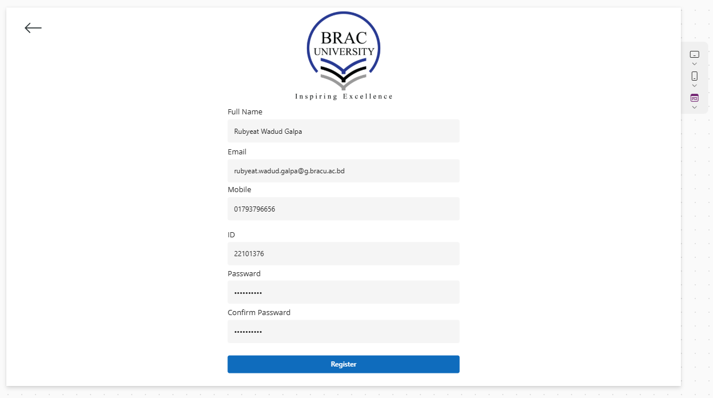
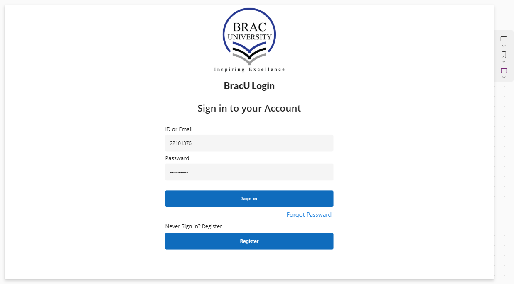
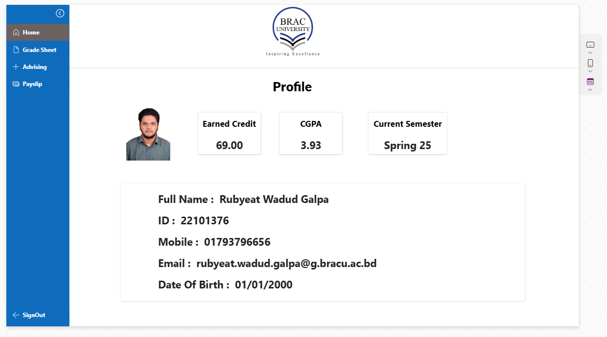
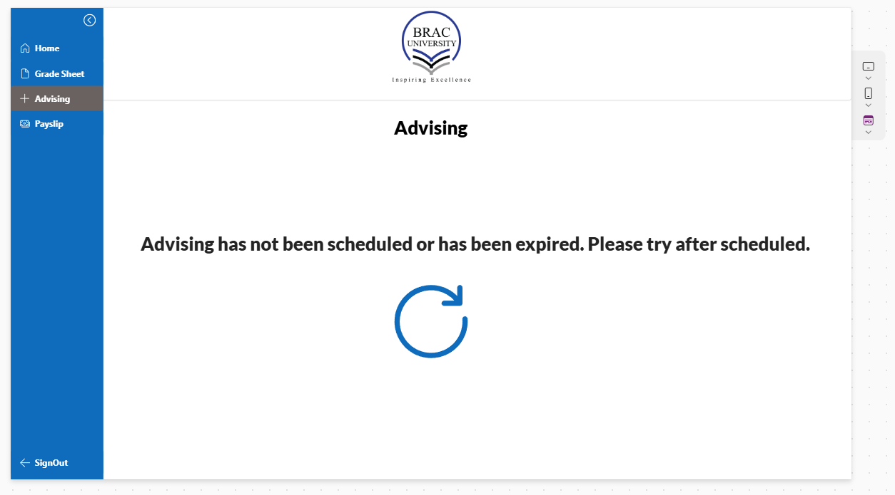
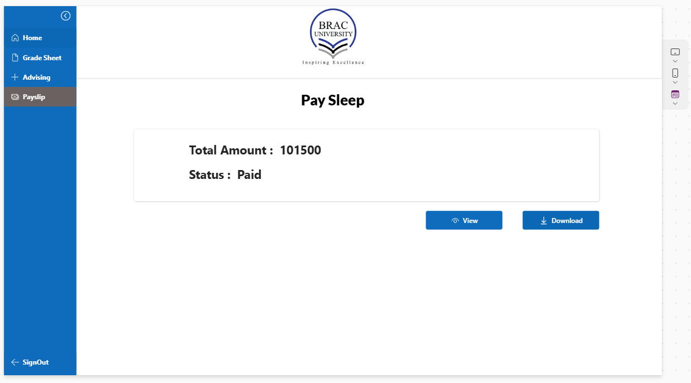
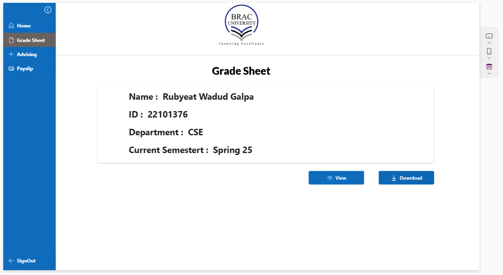

# 🎓 Brac University Application by PowerApps

This is a Microsoft PowerApps application developed for university students to manage academic and administrative tasks. The app allows students to register and log in using their email or student ID, then access various services such as advising, pay slips, and grade sheets through a clean and user-friendly interface.

## ✨ Features

- ✅ **User Registration**: Register with full name, email, student ID, and password.
- 🔐 **Secure Login**: Login with email or student ID and password.
- 🏠 **Homepage**: After login, users land on a clean homepage with easy navigation.
- 📋 **Left Navigation Menu**:
  - **Home**: Redirects to the homepage.
  - **Advising**: Access academic advising services.
  - **Pay Slip**: View and download student pay slips.
  - **Grade Sheet**: Check grades for completed courses.
  - **Sign Out**: Securely logout from the app.

---

## 🖼️ Screenshots

### 🔑 Registration Page

*Users can register by providing their personal information.*

### 🔓 Login Page

*Login using Email or Student ID and password.*

### 🏠 Homepage

*Main landing page with navigation panel.*

### 📚 Advising Page

*Get academic guidance or book appointments with advisors.*

### 💰 Pay Slip Page

*View or download student pay slips.*

### 📈 Grade Sheet Page

*Check academic performance and grades.*

---

## 🧠 Technologies Used

- [Microsoft PowerApps](https://powerapps.microsoft.com/)
- PowerFx (Formula-based logic)
- GitHub (Version control & source sharing)

---

**Rubyeat Wadud Galpa**  
📧 Email: rubgalpa@gmail.com  
🎓 Brac University

---

